<p align="center">
  
</p>

<p align="center">
  <a href="https://github.com/MarlboroJamez?tab=followers"></a>
  
  <a href="mailto:jameswilliamsmdl@gmail.com"></a>
</p>

<p align="center">
  <a href="https://www.linkedin.com/in/james-williams-mdl/"></a>
  <a href="https://x.com/marlborojamez"></a>
</p>

## `> hello_world`

I'm **James**, a full-stack engineer who enjoys going all the way down the stack—and occasionally past it. I build web products, poke at security, explore machine learning, and turn interesting rabbit holes into software that actually runs.

> Curiosity is the compass. Shipping is the proof.

```javascript
const james = {
  role: "Full-stack engineer",
  languages: ["PHP", "JavaScript", "Python", "Go"],
  rabbitHoles: ["cybersecurity", "machine learning", "algorithms"],
  coordinates: "under the sea 🌊",
  defaultMode: "learn → build → break → improve",
};
```

## `// toolkit`

<p align="center">
  
  
  
  
  
  
  
  
  
  
</p>

## `./selected_expeditions`

<table>
  <tr>
    <td width="50%" valign="top">
      <h3 align="center">📦 Composer Proxy</h3>
      <p>A PHP 8.1 Composer plugin for proxy management with parallel download support.</p>
      <p><code>PHP</code> <code>Composer</code> <code>Symfony</code></p>
      <p align="right"><a href="https://github.com/MarlboroJamez/composer-proxy">inspect the plugin →</a></p>
    </td>
    <td width="50%" valign="top">
      <h3 align="center">🧠 Machine Learning Hub</h3>
      <p>A lab of Python and notebook experiments, including Dijkstra pathfinding and sorting visualizers.</p>
      <p><code>Python</code> <code>Jupyter</code> <code>Algorithms</code></p>
      <p align="right"><a href="https://github.com/MarlboroJamez/machine-learning">explore the lab →</a></p>
    </td>
  </tr>
  <tr>
    <td width="50%" valign="top">
      <h3 align="center">📈 TradeTheMarket</h3>
      <p>Back-tested market tools and TradingView indicators that turn a trading checklist into a repeatable system.</p>
      <p><code>Pine Script</code> <code>Backtesting</code> <code>Markets</code></p>
      <p align="right"><a href="https://github.com/MarlboroJamez/TradeTheMarket">inspect the signals →</a></p>
    </td>
    <td width="50%" valign="top">
      <h3 align="center">🐦 Flappy Bird: 30 Liner</h3>
      <p>The classic game compressed into a wonderfully unreasonable thirty lines of HTML.</p>
      <p><code>HTML</code> <code>Game Dev</code> <code>Code Golf</code></p>
      <p align="right"><a href="https://github.com/MarlboroJamez/flappy-bird-30-liner">play with the code →</a></p>
    </td>
  </tr>
</table>

## `~ github_transmission`

<p align="center">
  
  
</p>

<p align="center">
  <picture>
    <source media="(prefers-color-scheme: dark)" srcset="https://raw.githubusercontent.com/MarlboroJamez/MarlboroJamez/output/github-contribution-grid-snake-dark.svg" />
    <source media="(prefers-color-scheme: light)" srcset="https://raw.githubusercontent.com/MarlboroJamez/MarlboroJamez/output/github-contribution-grid-snake.svg" />
    
  </picture>
</p>

---

<p align="center">
  <samp>Thanks for diving by. If an idea is weird, useful, or both—let's talk.</samp>
  <br />
  <sub>Built with curiosity, caffeine, and a questionable number of open tabs.</sub>
</p>
