<p align="center">
  
</p>

<!-- THE PUBLIC REPOSITORIES ARE OLD SIGNALS. -->

<br />

## `// UNKNOWN OPERATOR`

**I build intelligent systems in the hours nobody is watching.**

Not chatbots dressed up as products. Machines that can reason through a problem, use tools, remember what matters, recover when they fail, and keep moving.

I don't collect titles or stay inside a lane. I disappear into difficult problems, learn every layer they touch, and come back when the impossible thing is running.

> **Building strange, useful shit in the dark.**

```text
identity       : unresolved
status         : building
signal         : intermittent
last seen      : 03:17
daylight       : connection refused
```

## `// CURRENT TRANSMISSION`

The repositories you can see are old signals.<br />
The current work is deeper, quieter, and not ready to explain itself.

<details>
  <summary><code>OPEN THE BLACK BOX</code></summary>
  <br />
  Somewhere between intelligence and infrastructure, research and engineering, control and emergence.
  <br /><br />
  If it can be understood, it can be built.<br />
  If it cannot, that's where I start.
</details>

<br />

## `// ACTIVITY TRACE`

<p align="center">
  <picture>
    <source media="(prefers-color-scheme: dark)" srcset="https://raw.githubusercontent.com/MarlboroJamez/MarlboroJamez/output/github-contribution-grid-snake-dark.svg" />
    <source media="(prefers-color-scheme: light)" srcset="https://raw.githubusercontent.com/MarlboroJamez/MarlboroJamez/output/github-contribution-grid-snake.svg" />
    
  </picture>
</p>

---

<p align="center">
  <sub><code>THERE IS ALWAYS ANOTHER LAYER.</code></sub>
</p>
